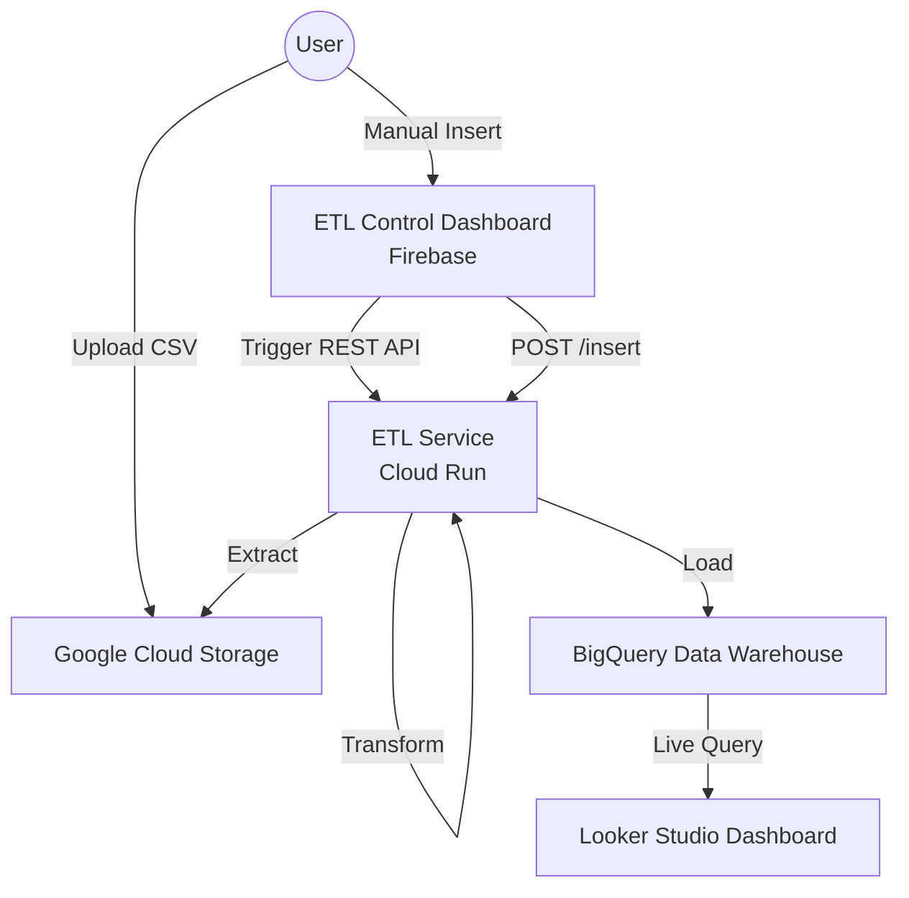

# A Serverless Hybrid ETL Architecture for Real-Time E-Commerce Analytics

This repository implements a fully cloud-native, serverless ETL pipeline on Google Cloud Platform (GCP) designed for processing e-commerce transactional data. The architecture supports both high-volume batch ingestion and low-latency real-time record insertion.

## 🚀 Overview

The system automates the extraction of raw retail transaction data from **Google Cloud Storage (GCS)**, performs transformations using **Cloud Run**, and loads the cleaned data into **BigQuery** for analysis. A custom dashboard hosted on **Firebase** provides a centralized control interface for execution monitoring and manual record insertion.

### Key Features
- **Serverless & Scalable**: Entirely managed GCP components with zero infrastructure overhead.
- **Hybrid Ingestion**: Supports batch processing for historical data and REST API for real-time updates.
- **Automated Data Quality**: Schema validation, data type normalization, and anomaly filtering during the transformation phase.
- **Real-Time Visualization**: Direct integration between BigQuery and Looker Studio for live BI dashboards.

---

## 🏗️ Architecture



### Components
1.  **Google Cloud Storage (GCS)**: Acts as the raw data lake for CSV ingestion.
2.  **Cloud Run**: Containerized Python/Flask microservice for ETL logic.
3.  **BigQuery**: Highly optimized analytical store with partitioned tables.
4.  **Firebase Hosting**: Hosts the ETL Control Dashboard.
5.  **Looker Studio**: Real-time business intelligence visualization.

---

## 🛠️ Project Structure

```text
├── data/               # Raw datasets (e.g., dataset.csv)
├── docs/               # Project documentation and reports
├── etl_files/          # Backend code for Cloud Run
│   ├── main.py         # ETL logic & REST API
│   ├── Dockerfile      # Container configuration
│   └── requirements.txt
├── public/             # Frontend Dashboard code (Firebase)
│   ├── index.html
│   ├── script.js
│   └── style.css
├── firebase.json       # Firebase configuration
└── README.md
```

---

## 📊 Methodology & Implementation

### Data Transformation Phase
The pipeline performs several critical preprocessing steps:
- **Schema Validation**: Ensures all incoming records match the expected format.
- **Missing Value Handling**: Filters records with null critical fields (Price, Quantity, etc.).
- **Anomaly Detection**: Removes negative quantities or pricing anomalies.
- **Revenue Calculation**: Derives a `Revenue` attribute (`Quantity * Price`) for enhanced analytics.
- **Normalization**: Standardizes categorical data like country names.

### Data Loading
Data is loaded into **Partitioned BigQuery Tables**. Partitioning by transaction timestamp ensures:
- Reduced query scan costs.
- High performance for time-series analysis and aggregations.

---

## 📈 Performance & Cost Analysis

Based on the technical evaluation in the [Final Report](docs/ETL__Final.pdf):
- **Latency**: Batch execution for medium-sized datasets typically completes within **2-4 seconds**.
- **Scalability**: Linear scaling observed with increasing dataset sizes thanks to Cloud Run's horizontal scaling.
- **Cost**: Entirely usage-based pricing model (Pay-as-you-go), eliminating idle resource costs.

---

## 🚀 Setup & Deployment

### Prerequisites
- GCP Account with Project ID.
- BigQuery Dataset and GCS Bucket.
- Firebase CLI installed.

### Backend Deployment (Cloud Run)
1. Go to `etl_files/`.
2. Deploy the service:
   ```bash
   gcloud run deploy etl-transform-service --source .
   ```

### Frontend Deployment (Firebase)
1. Update `CLOUD_RUN_URL` in `public/script.js`.
2. Deploy to Firebase:
   ```bash
   firebase deploy
   ```

---

## 👨‍💻 Authors
- **K. Bruhadesh Varma**


## 📜 Usage Policy

> [!CAUTION]
> **Owner Approval Required**: This project is for research and demonstration purposes. Any reproduction, distribution, or use of this project in other environments requires explicit prior approval from the project owners (**K. Bruhadesh Varma** and co-authors).


---
> [!NOTE]
> This project was developed as part of research into serverless cloud data engineering at Amrita School of Computing.
